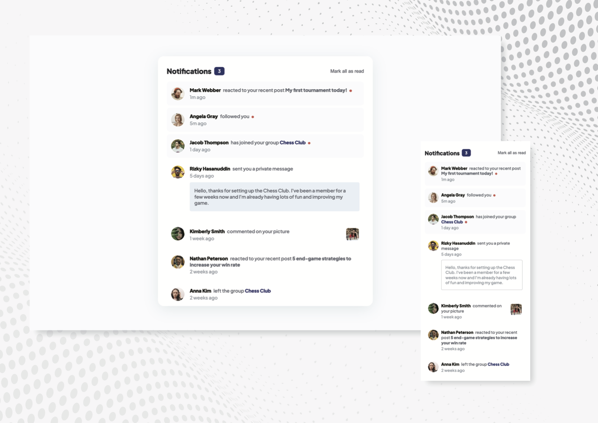

# Frontend Mentor - Notifications page

This is my solution to the Notifications page

## Table of contents

- [Overview](#overview)
  - [Screenshot](#screenshot)
  - [Links](#links)
- [My process](#my-process)
  - [Built with](#built-with)
  - [Continued development](#continued-development)
- [Author](#author)

## Overview

- Distinguish between "unread" and "read" notifications
- Select "Mark all as read" to toggle the visual state of the unread notifications and set the number of unread messages to zero
- View the optimal layout for the interface depending on their device's screen size
- See hover and focus states for all interactive elements on the page

### Screenshot

#### Desktop and mobile versions of layout

### Links

- Live Site URL: https://notifications-page-nadiafr.netlify.app/

## My process

### Built with

- Semantic HTML5 markup
- SASS architecture 
- Flexbox

### Continued development

Apply SASS on more complexe layout. Integrate more JS. Use React for small projects.

## Author

Nadia Furzikova - front-end developer,
based 📍 Nancy/France
